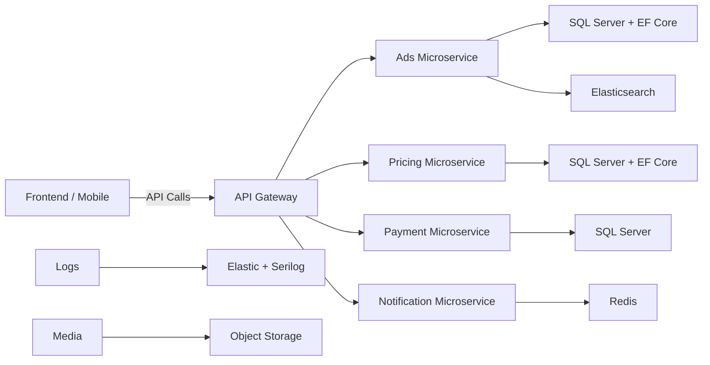

# **Portfolio Sample: Bama Platform Migration – .NET Core Microservices**

**Role:** Lead Backend Developer
**Tech Stack:** C#, .NET Core, EF Core, Dapper, Redis, Elasticsearch, SQL Server, RabbitMQ, Docker, CI/CD, Serilog, Keycloak, DDD, CQRS, Clean Architecture

---

## **Project Overview**

Led the full migration of a high-traffic legacy MVC platform to a scalable .NET Core microservices architecture serving 50k+ daily users. The project demonstrates expertise in system design, backend optimization, team leadership, and cloud-native deployments.

Key Goals:

* Modernize architecture from monolith to microservices
* Improve performance, scalability, and reliability
* Introduce maintainable, testable, and secure systems
* Guide the team through complex technical transitions

---

## **System Architecture**

```mermaid
flowchart TB
    subgraph User Layer
        WebApp[Web Frontend] --> API Gateway
        MobileApp[Mobile App] --> API Gateway
    end

    subgraph Backend Layer
        API Gateway -->|REST/gRPC| AuthService[Auth Service (Keycloak)]
        API Gateway --> AdService[Vehicle Ads Service]
        API Gateway --> PricingService[Price Estimation Service]
        API Gateway --> PaymentService[Payments & Wallets]
        API Gateway --> NotificationService[SMS/Telegram Notifications]
    end

    subgraph Data Layer
        AdService --> SQL[SQL Server / EF Core]
        PricingService --> SQL
        PaymentService --> SQL
        AdService --> ES[Elasticsearch]
        NotificationService --> Redis[Redis Cache]
        Logs --> ESLogs[Elasticsearch Logs via Serilog]
        Media --> MinIO[Media Storage (MinIO/S3)]
    end
```

---

## **Key Contributions**

* **Architecture & Design:**

  * Designed modular microservices architecture using **DDD** and **CQRS** principles.
  * Applied **Clean Architecture** for maintainability and separation of concerns.

* **Performance Optimization:**

  * Reduced API latency by up to **60%** and query times by **70%** using Redis caching, async I/O, EF Core/Dapper optimizations, and SQL tuning.
  * Elasticsearch enabled advanced search and filtering for vehicle ads.

* **Feature Development:**

  * Built key business modules: Pricing APIs, Vehicle Ads management, SMS/Telegram notifications, Payment and Wallet microservices.
  * Integrated SSO with Keycloak and secure token-based authentication (JWT).

* **Team Leadership:**

  * Mentored junior developers, conducted code reviews, and enforced SOLID & clean coding practices.
  * Facilitated knowledge sharing and cross-team collaboration.

* **DevOps & CI/CD:**

  * Dockerized services for consistent deployments.
  * Implemented CI/CD pipelines for automated build, test, and deployment processes.
  * Centralized logging and monitoring via Serilog + Elasticsearch.

---

## **Impact & Results**

| Metric                       | Result                                             |
| ---------------------------- | -------------------------------------------------- |
| Downtime                     | Reduced by 30%                                     |
| API Latency                  | Reduced up to 60%                                  |
| Critical Queries             | Improved up to 70%                                 |
| Daily Active Users Supported | 50,000+                                            |
| Developer Velocity           | Improved by introducing Clean Architecture & CI/CD |
| Team Mentorship              | Junior devs onboarded and productive faster        |

---

## **Learning & Growth**

* Mastered microservices design, distributed systems, and cloud-native deployment.
* Strengthened **leadership skills** by mentoring team members during a major migration.
* Learned to **balance technical excellence with business needs**, ensuring the solution was scalable, maintainable, and aligned with company goals.

---

## **Architecture Diagram (High-Level Overview)**



---

## **Why This Project Represents My Expertise**

* **Full-Stack Backend Mastery:** From database optimization to microservices, API design, and caching strategies.
* **System Architecture:** Practical implementation of DDD, CQRS, and Clean Architecture in high-load production systems.
* **Team Leadership:** Mentoring, knowledge transfer, and enforcing best practices.
* **DevOps & Cloud:** CI/CD, Docker, centralized logging, and scalable deployment strategies.
* **Impact-Driven:** Achieved measurable improvements in performance, reliability, and user experience.

Do you want me to do that next?
